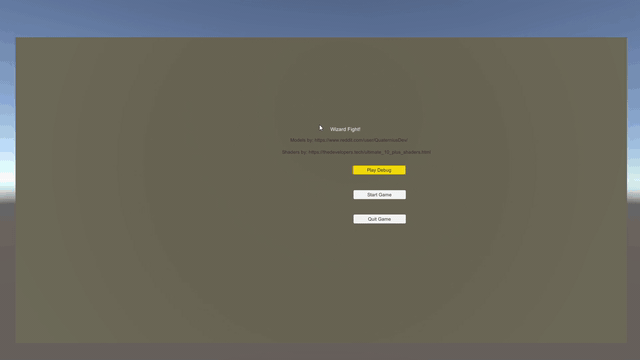

# WizardFight
This is a game that started with me wanting to learn the Unity game engine better, and evolved into a basic first game. It lacks some polish, but it's good for what it is. Play it here, you'll need two controllers connected locally to your computer: https://spyrix.itch.io/wizard-fight

Showing the main menu and spell selection.

Showing off two controller support, the aiming arrow, and the disintegrate spell.

Showing off the teleport spell, the aiming reticle, and the cooldown.

Showing off the electric spell.

Showing off the ice spell, and how it freezes a character.

Showing off victory, jumping, and looping back to the main menu.

Models by: https://www.reddit.com/user/QuaterniusDev/
Shaders by: https://thedevelopers.tech/ultimate_10_plus_shaders.html
